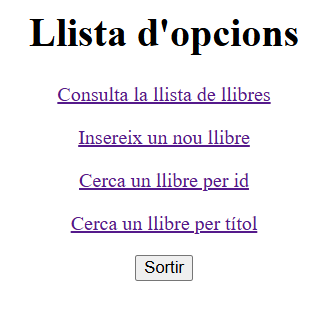

# M06-UF4-A02

## Creación de el usuario

Creamos el usuatio maria con su contraeña correspondiente, y le damos todos los privilegios, (lectura, escritura, ...) 

## Pruebas de uso 

A continuación, en la imagen podemos observar un intento de login con las credenciales introducidas de forma erroenea 

Una vez introducidos los paremetros de forma correcta, podremos acceder al menu de la pagina principal. Denediendo de la opción que seleccionemos nos llevara a dicha función.

Al pulsar "consulta la llista de llibres" no trasladaria a la siguiente vista donde aparecen en una tabla los libros que ya excistentes en la base de datos.

Si deseamos añadir un nuevo libro deberiamos presionar en el menu la opción de "Insereix un nou llibre", y a continuacion deberemos completar todos los parametros requeridos. 

Una ves completaado el registro si regresamos al listado de libros podremos apreciar que aparece el muevo que hemos insertado. 

En la siguiente captura podemos ver  el resultado de MariaDB antes y despues de el select 

Si en el menu inicial seleccionamos la opción de "cercaa un llibre per id", nos llevara a la siguiente pantalla donde escribiremos la id del liobro que deseemos buscar. 

Una vez realizada la busqueda correctamente podremos ver todos los datos de el libro en una vista de tabla. 

